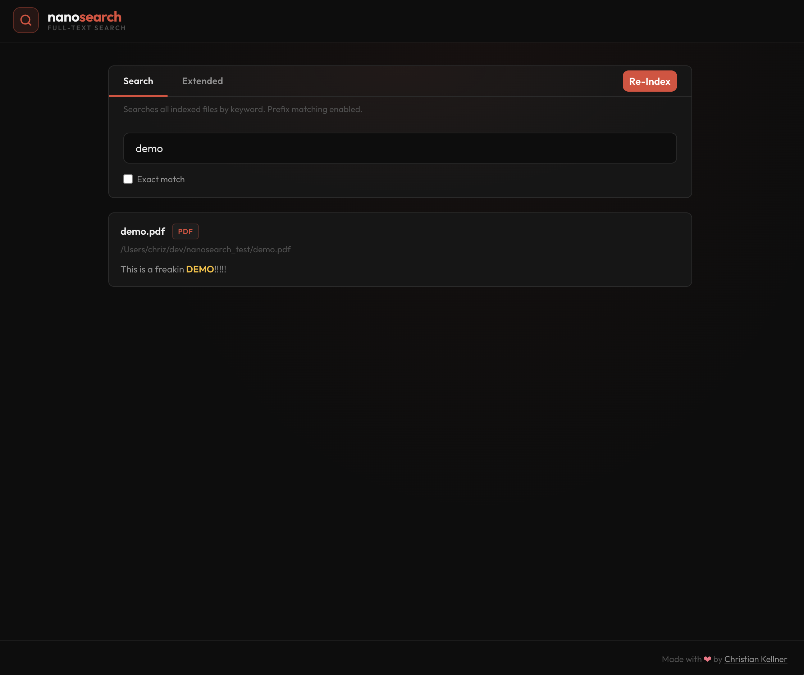
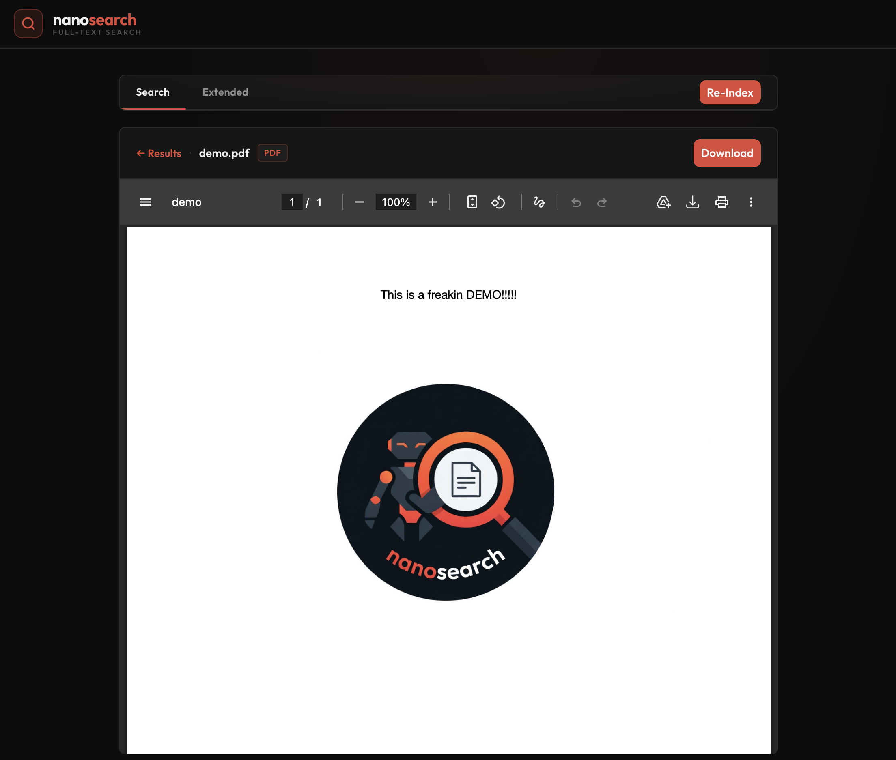

# nanosearch

<p align="center">

<a href="https://orange-coding.net/">
<picture>
  
</picture>
</a>
</p>

A web-based full-text search tool for local directories. Easy indexing of your files, then search them instantly via a browser. Without bullshit, extremely lightweight.

<p align="center">
  
  
  
</p>

---

## Features

- Full-text search with SQLite FTS5 (BM25 ranking, highlighted snippets)
- Incremental re-indexing, only new or changed files are processed
- OCR for scanned PDFs and images (Tesseract.js locally, Tesseract CLI in Docker)
- Supports all sorts of files, e.g. PDF, DOCX, TXT, Markdown, JPG, PNG, TIFF
- Real-time indexing progress
- Rendering your files directly in the browser if possible

---

## Screenshots

| Search                       | Rendering View                       |
| ---------------------------- | ------------------------------------ |
|  |  |

---

# Quick Start

## "Bare Metal"

**Prerequisites:** Node 22

```bash
# 1. Install dependencies + download Tesseract language data (~25 MB, once)
yarn inst

# 2. Configure
cp .env.example .env

# 4. Start the app
yarn start
```

Open `http://localhost:3000`, click **Create Index**, then search.

## Development

**Prerequisites:** Node 22

```bash
# 1. Install dependencies + download Tesseract language data (~25 MB, once)
yarn inst

# 2. Configure
cp .env.example .env

# 3. Start the backend (Terminal 1)
cd lib/backend
node --no-deprecation --watch src/server.js

# 4. Start the frontend (Terminal 2)
yarn dev
```

Open `http://localhost:5173`, click **Create Index**, then search.

---

## Docker

```bash
# 2. Configure
cp .env.example .env

# 2. Add volume mounts to docker-compose.yml for each directory in SEARCH_DIRS
# See the comment block in docker-compose.yml

# 3. Start
docker compose up -d
```

Open `http://localhost:3000`, click **Create Index**, then search.

---

## Configuration

All options are set via environment variables (or `.env` at the project root):

| Variable      | Default              | Description                                                                  |
| ------------- | -------------------- | ---------------------------------------------------------------------------- |
| `SEARCH_DIRS` | _(required)_         | Comma-separated list of directories to index                                 |
| `DB_PATH`     | `./db/nanosearch.db` | Path to the SQLite database file                                             |
| `OCR_BACKEND` | `js`                 | `js` (Tesseract.js) or `cli` (Tesseract CLI)                                 |
| `PORT`        | `3000`               | Backend port                                                                 |
| `LOG_LEVEL`   | `info`               | Pino log level                                                               |
| `EXTENSIONS`  | _(see .env.example)_ | Complete list of extensions to index. Nothing is indexed unless listed here. |

---

## OCR Backends

| Backend | How                                      | When to use              |
| ------- | ---------------------------------------- | ------------------------ |
| `js`    | Tesseract.js (pure Node, no system deps) | Local development        |
| `cli`   | System `tesseract` binary                | Docker (default), faster |

Both backends recognise German and English simultaneously (`deu+eng`).
